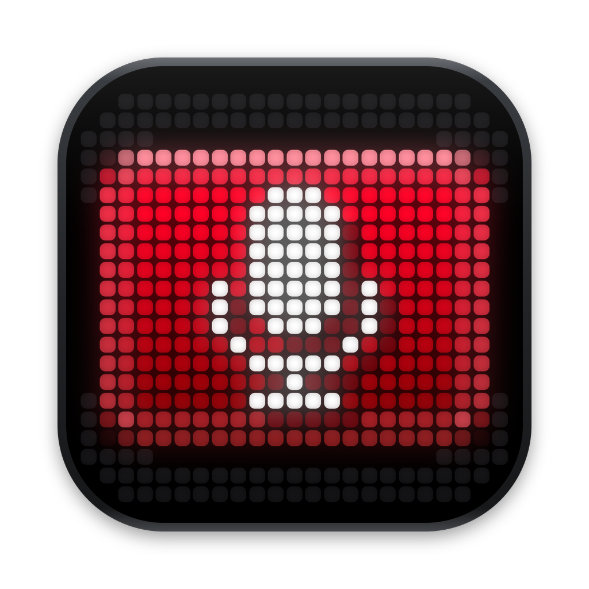
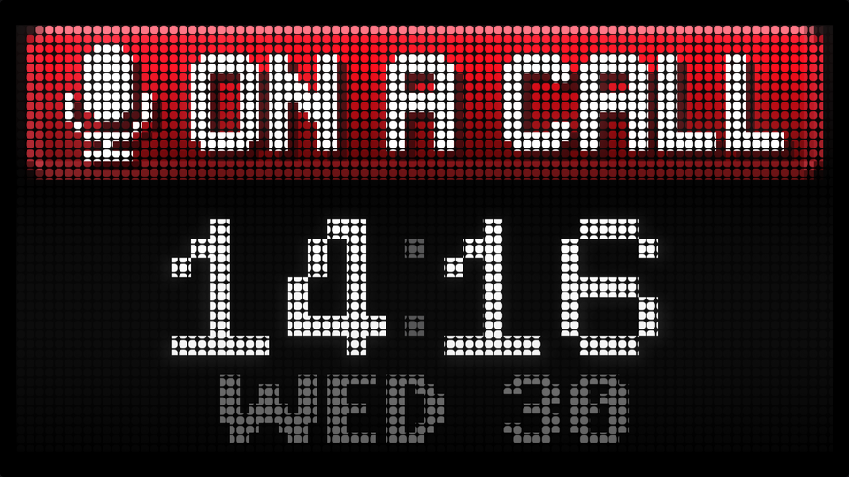
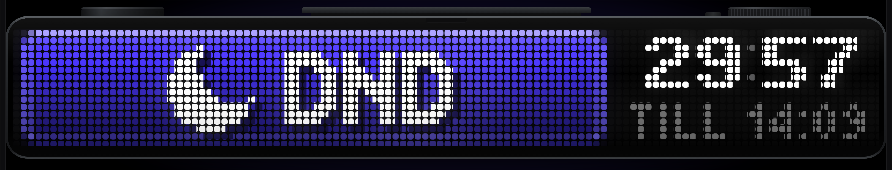
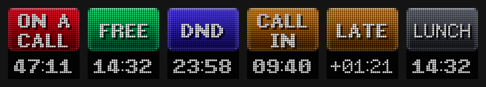

# Busy Bar Sign




A full-screen wall display for a Mac: a pixel-LED status bar in the style of
Flipper's BUSY Bar, showing **ON A CALL** or **FREE** beside a clock — or the
same bar as a small floating window on your desk screen, or a **stacked
layout** that fills a small monitor. Double-click it for a 30-minute **Do Not
Disturb**. The
state is detected automatically from which app has your microphone — Zoom,
Teams, Google Meet, FaceTime, or anything else — and from **your calendar**:
it warns people ten minutes before a call (**CALL IN 09:41**), says when
you're **LATE FOR** one, shows **MEETING**, **LUNCH**, **AWAY** and **OUT OF
OFFICE**, and on a call counts down to when you're free.
[More below](#your-calendar). A **Stream Deck** key can show it too, and
start Do Not Disturb when you press it ([below](#stream-deck)).

**See it without installing anything:** download the repo and open
`simulator/index.html` in a browser. It runs the same drawing engine and
the same calendar rules as the app, on your real clock. Its buttons show the
floating window and the stacked layout, **Calendar day** plays a working day
through the rules, and the redesigned settings window is beneath; double-click
the bar for Do Not Disturb.

The first version — a broadcast studio clock beside an on-air-style sign,
called Studio Call Sign — is kept on the
[`v1-studio-call-sign`](../../tree/v1-studio-call-sign) branch; its mock is `mock.html`.

| ON A CALL | FREE |
|---|---|
|  |  |

As a floating window (the simulator's **Floating window** button shows this):


On a small monitor such as 960 × 540, with **Layout** set to **Stacked** (the
simulator's **Stacked layout** button shows this — [more below](#small-screens-the-stacked-layout)):



## Download

**[Download the latest build](https://github.com/woody438/busy-bar-sign/releases/latest)**
(`BusyBarSign.zip`).

1. Unzip it and drag **Busy Bar Sign** into Applications. (If you have the
   older **StudioCallSign** there, delete it: that was this app's old name.)
2. Open it. The first time, macOS says it can't check the app for malicious
   software, because it isn't notarised by Apple. Click **Done**, then go to
   System Settings ▸ Privacy & Security, scroll down, and click **Open Anyway**.
   (Or in Terminal: `xattr -dr com.apple.quarantine "/Applications/Busy Bar Sign.app"`.)
3. The full-screen display opens on your second monitor, and a **controls
   window** opens on your main one. Click the app's Dock icon to bring the
   controls back at any time.
4. For a Stream Deck, also download `BusyBarSign.streamDeckPlugin` from the
   same release ([more below](#stream-deck)).

It runs on Apple silicon and Intel Macs with macOS 14.4 or later. Every push
to `main` rebuilds it on GitHub's Mac runners
(`.github/workflows/build.yml`) and replaces the release. A pull request's
build is published as the **preview** pre-release instead, for trying before
it's merged.

> **In use on one Mac.** It runs day to day on its author's Mac — the sign,
> the microphone, an Outlook calendar and the Stream Deck key — and its
> checks pass on every build, but it hasn't been tried on other setups. See
> [What's been verified](#whats-been-verified--and-what-hasnt).

## Build it yourself

You need macOS 14.4 or later, **Xcode 15.3 or later** (the Core Audio process
API it uses first appears in the macOS 14.4 SDK; older Xcode won't compile it),
and [Homebrew](https://brew.sh).

```sh
git clone https://github.com/woody438/busy-bar-sign
cd busy-bar-sign
brew install xcodegen
xcodegen generate
open BusyBarSign.xcodeproj           # then Product ▸ Run (⌘R)
```

Or without opening Xcode:

```sh
xcodebuild -project BusyBarSign.xcodeproj -scheme BusyBarSign \
  -configuration Release -derivedDataPath build build
open "build/Build/Products/Release/Busy Bar Sign.app"
```

- It signs with **Sign to Run Locally**, so no Apple developer account is needed.
- Change build settings in `project.yml`, not in Xcode — `xcodegen generate`
  replaces the project, including anything changed in its settings screens.
  Re-run it after adding or removing source files.
- There are no permission prompts: the app checks whether devices are *in use*;
  it never records.

## Setting up the wall display

- **Use the display's default "looks like 1920 × 1080", or its native
  resolution** (System Settings ▸ Displays). A scaled mode such as "looks like
  2560 × 1440" makes macOS resample the whole screen, so the LED dots can't
  land on whole pixels and may shimmer. The menu warns you if this is the case.
- On first launch the bar opens on whichever display *isn't* your main
  (menu-bar) display, and remembers that monitor. If the wall monitor isn't
  connected yet, it shows on the main display until it is. To move it, pick
  another **Monitor** in the controls window (**Show on** in the menus).
- If the wall monitor sleeps, switches off or is unplugged, the bar waits for
  it rather than jumping onto your desk monitor, and comes back when it does.
- On a secondary display the bar sits above that display's menu bar and Dock,
  so nothing covers it while you're in another app. Clicking it never pulls
  focus from a call: a double-click toggles Do Not Disturb, and single
  clicks do nothing.
- While it's showing, the Mac won't let displays sleep. macOS applies that to
  every display, not just the wall.

## The floating window

As well as the full-screen display — or instead of it — the bar can float on
your desk screen: just the device, in a window that stays above other windows
and on every Space, including full-screen apps.

- Turn it on with **Floating window** in the controls window or either menu.
  **Full-screen display** is a separate switch, so you can have either or both.
- **Drag it anywhere.** It never takes focus, so moving it mid-call leaves
  you in the call app.
- **Floating size** — Small, Medium or Large (600, 900 or 1200 points wide).
  On a Retina screen these put the LEDs on exactly 10, 15 or 20 pixels. Also
  on its right-click menu.
- It remembers where it was, its size, and which views were on when you quit.
  First launch opens the full-screen display only.

## Small screens: the Stacked layout

For a small monitor — say a 960 × 540 desk display — set **Layout** to
**Stacked (small screens)** in the controls window or the menu-bar menu. The
status pill runs across the top, the time sits beneath it in 14-row digits
with the day under that, and the LEDs fill the screen with no case around
them (a small monitor has its own bezel). On 960 × 540 each LED is 11 pixels
and the panel fills 90% of the screen's height.

Everything else works the same: the change animation (the announcement fills
the screen on two lines, then draws up into the pill as the clock rises),
Do Not Disturb (its countdown takes the time's place), and double-clicking.
**Wide bar** stays the default, and the floating window always uses it.

Stacked is made for small screens, where it's cheap to draw (under 1 ms a
frame at 960 × 540). You can use it on a big screen too; on 4K it draws 7
million pixels, and during the second or so of a change's shockwave a slower
Mac may drop below 60 frames a second (never below 30).

## Do Not Disturb



**Double-click the bar** — full-screen or floating — and it goes to
**DO NOT DISTURB** for 30 minutes: an indigo pill with a moon, and a countdown
where the clock was, with its end time beneath. **Double-click again** to end
it and go back to FREE. It's also in the controls window, the menu-bar menu,
the Dock menu and the floating window's right-click menu (**Do Not Disturb
(30 min)** / **End Do Not Disturb**).

- **A call outranks it.** If a call starts, the bar shows ON A CALL; when the
  call ends, it goes back to Do Not Disturb with whatever time is left. The
  countdown keeps running during the call, so a 10-minute call in a 30-minute
  Do Not Disturb leaves about 20 minutes.
- If it runs out during a call, the bar returns to FREE when the call ends.
- It survives quitting and reopening the app.

## Stream Deck



A **Status** key for an Elgato Stream Deck: the bar on a key, live — its
colour, its words, and beneath them the countdown or the time, drawn by
the bar's own engine and fonts. **Press it** for Do Not Disturb, as you'd
double-click the bar; press again to end it. On a call the sign stays ON A
CALL, so the key flashes a tick to say the press counted.

1. Download **`BusyBarSign.streamDeckPlugin`** from the
   [latest release](https://github.com/woody438/busy-bar-sign/releases/latest)
   and double-click it. Stream Deck asks to install it. (Stream Deck 7.1 or
   later.)
2. In Stream Deck, drag **Busy Bar Sign ▸ Status** onto a key — on as many
   keys, pages and Stream Decks as you like.

- The words are the bar's, cut to fit a key: ON A / CALL, IN A / MTG for a
  meeting, CALL / IN 09:41, FREE / TILL 15:00, TBC / TILL once a tentative
  meeting is on, OOO.
- It asks the app once a second, on the second, so its countdown turns with
  the bar's. While the app isn't running the key says **APP OFF**, and a
  press flashes a warning.
- It reaches the app through a small web server on the Mac itself,
  `127.0.0.1:47811`, which nothing on the network can reach and a web page
  can't use (`Sources/LocalAPI.swift`). If the controls say the Stream Deck
  can't reach the app, something else has that port.
- If double-clicking doesn't install it, quit Stream Deck, unzip the file
  (it's a zip) and copy `com.woodall.busybarsign.sdPlugin` into
  `~/Library/Application Support/com.elgato.StreamDeck/Plugins`, then open
  Stream Deck again.
- To work on it: `cd streamdeck && npm ci && npm run build`, then
  `npx streamdeck link com.woodall.busybarsign.sdPlugin` runs it from the
  source folder; `npm run pack` makes the `.streamDeckPlugin`, and
  `npm run sheet` draws every state to `keys.png` to check by eye.

## Your calendar

The sign follows the calendar macOS Calendar shows — for Outlook, add your
Microsoft 365 account in Calendar ▸ Settings ▸ Accounts — read-only. Allow
calendar access when it asks on first launch, then check **Calendar** in the
controls window's Calendar tab is the one you use. It picks the Exchange
account's own "Calendar" by itself.

| The bar | What puts it there |
|---|---|
| **ON A CALL** · *47:12 TILL 11:30* | An app has your microphone. On a call in your calendar it counts down to when you're free, carried through back-to-back meetings (5 minutes apart or less); an hour or more reads *1H05*. Or an event of your own with **call** in the title (e.g. "Call - Linda"), for calls on your phone. |
| **MEETING** · *countdown* | A meeting with invitees and no Teams, Zoom or Meet link. |
| **CALL IN** / **BUSY IN** · *09:41 AT 11:00* | Ten minutes before a call, or a meeting in person. Amber. |
| **LATE FOR** · *CALL +01:20* | A call has started and your microphone hasn't. It pulses, for up to ten minutes, then gives up and shows FREE. |
| **FREE TILL** · *11:00* | You left a call before its slot ended and something else starts straight after it (within 5 minutes): free till then. With nothing straight after, just **FREE**. |
| **CALL TBC** / **BUSY TBC** | Show As **Tentative**: a countdown to the start, then the end time. Never LATE — you may not be going. |
| **DND** | An event titled **No meetings** or **Focus**. Warnings for calls inside it still show. |
| **LUNCH** | An event of your own with **lunch** in the title. It beats any meeting over it, warnings included. |
| **AWAY** | Any other event of your own (no invitees): "Gym", "Drive home". |
| **OUT OF OFFICE** | Show As **Out of Office**, an all-day busy event, or **✈** in the title (flight apps put it there). |

Ignored: Show As **Free**, cancelled meetings ("Canceled: …"), and all-day
events that aren't busy. Declined meetings leave Outlook, so they never count.

**Who wins**, highest first: your **Sign** setting; the microphone; a
double-click Do Not Disturb; then the calendar — out of office, lunch, away,
a phone-call block, an in-person meeting, a call you're late for, a warning,
a tentative meeting, a no-meetings block, and a call you left early with
something straight after it.

The title words for your own events are in the Calendar tab: whole words,
any case, separated by commas. Meetings are sorted by their invitees and
join link, so their titles never matter.

Worth knowing:

- **Exchange Web Services is being switched off.** macOS Calendar syncs
  Microsoft 365 over EWS, which Microsoft began turning off on 1 October 2026
  and removes on 1 April 2027; Apple says Calendar will move to Microsoft
  Graph in a macOS 27 update. The app reads whatever Calendar.app holds, so
  it won't need changing — but if your company's EWS goes off before Apple's
  update arrives, Calendar.app stops updating without saying so. The
  controls warn when nothing in the calendar has changed for a couple of
  working days.
- macOS can lag Exchange: a meeting moved in Outlook may take a while to
  move on the Mac. `killall exchangesyncd` makes it sync again.
- When the Mac is locked, the lock screen covers every display, the wall
  included; no app can draw over it.

## The controls

The same controls are in three places:

- **The controls window** — click the app's Dock icon, or press ⌘, while the
  app is in front. It opens by itself on first launch. Four tabs:
  **Status** (the bar live, why it says what it says, Sign and Do Not
  Disturb), **Displays** (the full-screen display and the floating window
  side by side), **Calendar** (which calendar, the warning and late times, a
  guide to what to put in Outlook, and the title words) and **Microphone**
  (what counts as a call, and what's using the mic now, to ignore).
- **The Dock icon's right-click menu** — full-screen on/off, which monitor,
  floating on/off.
- **The menu-bar icon** — the state's own mark: a tick when free, a
  microphone on a call, a bell before one, a moon for Do Not Disturb, a
  knife and fork at lunch. On a crowded menu bar macOS may hide it; the other
  two always work.

The full menu:

- **Status** — what the sign says and why, e.g. "Call soon: “Weekly review”",
  and what the detector sees, e.g. "Source — zoom.us · mic active · cam active".
- **Sign** — Automatic, or force ON A CALL / FREE (for in-person meetings, recording).
- **Detect** — *Any app except ignored* (default) or *Known call apps only*.
- **Do Not Disturb (30 min)** / **End Do Not Disturb**.
- **Microphone** — every app holding the mic right now, each with an
  **Ignore** toggle. If something that isn't a call lights the sign, ignore it
  here; it's remembered.
- **Full-screen display** (on/off), **Show on** (which monitor; the
  controls window calls it Monitor) and **Layout** (Wide bar, or Stacked
  for small screens).
- **Floating window** (on/off) and **Floating size**.
- **Follow My Calendar** (on/off).
- **Settings…** (⌘,) opens the controls window; **Quit** (⌘Q). Opening the app again with nothing showing brings the
  full-screen display back.

## How it decides you're on a call

Once a second it asks Core Audio which processes have microphone input
running (`kAudioProcessPropertyIsRunningInput`, macOS 14.2+). For each one:

1. **Helpers count as their app.** Browsers and Electron apps capture audio in
   helper processes, so each process is traced to the outermost `.app` it runs
   from: Meet in a Chrome helper counts as Chrome.
2. **Dictation and audio tools are ignored** — Wispr Flow, superwhisper,
   MacWhisper, Talon, Krisp, DAWs, OBS — by bundle ID, and dictation tools by
   name too, in case the bundle ID is one it doesn't know.
3. **Apple's own processes are ignored** — Siri, Dictation, Live Captions,
   Sound Recognition (which listens all the time) — **except** FaceTime (whose
   audio runs in `avconferenced`) and Safari (whose audio runs in WebKit).
4. **Anything else counts**, under the default policy. *Known call apps only*
   restricts it to a list in `CallDetector.swift`.

The sign follows only once a change has held: **2 seconds** before it lights,
**10 seconds** before it goes dark, so a moment's silence never flickers it.
Zoom, Teams and Meet keep the mic open while you're muted, so the sign stays
lit through mute.

Worth knowing:

- Some apps release the mic when you mute (Slack huddles and Discord, reportedly).
  During a long mute in those, the sign returns to FREE after 10 seconds.
- The Wispr Flow bundle IDs in the ignore list are best guesses. If dictation
  lights the sign, use **Microphone ▸ Ignore Wispr Flow** once.
- If Core Audio's per-process API ever fails to answer, it falls back to "is
  the default input device in use by anyone" — which can't tell dictation
  from a call. The status line then says "unattributed".

## How the display works

The bar is **118 × 16 LEDs**. Sixteen rows is what gives the BUSY Bar's type its
chunk, so that's kept; the real device is 72 columns, too narrow to set
"ON A CALL" beside a clock, so this one runs wider. At 32 pixels per LED it
spans a 4K screen exactly: full width, 31% tall, every LED on whole pixels.

Almost everything comes from the BUSY Bar's own open-source firmware:

- **Pixel fonts** — decoded from the firmware (OFL-licensed): `busy_bold_10`
  for the status, `busy_regular_14` for the announcement, `busy_bold_7` and
  `busy_regular_5` for the clock, as the firmware's clock app uses them.
- **Colours** — sampled from its animation frames: the pill's red and green
  gradients, highlight row and rim.
- **Dots** — Flipper's own preview shader: rounded squares at 85% of the
  pitch, shading toward their corners; unlit LEDs vanish into the black face.
  Colours are corrected for the firmware's LED gamma (value^2.6–2.8).
- **Layout** — its timer screen: lit pill on the left; time in white on black
  to the right, day beneath at half brightness; colon dimming on odd seconds.
- **A change of state** — as the device does it: the old screen presses down,
  a ring bursts from the top edge and floods the panel, and the new screen
  springs up. The status fills the bar in 14-row capitals for a few seconds,
  then the pill draws back and the time slides in beside it.

The words are **ON A CALL** rather than the firmware's own "ON CALL", which in
British English means on standby. The mic pictogram echoes the firmware's
on-call theme; the tick is the "available" mark meeting apps use.

In the code:

| | |
|---|---|
| `Sources/Bar/BarEngine.swift` | Decides every LED's colour for a moment in time. A line-for-line port of `simulator/engine.js`. |
| `Sources/Bar/LEDRaster.swift` | Turns a frame into panel pixels: dots, shading, gamma, glass. |
| `Sources/Bar/LEDPanelView.swift` | Runs engine and raster on each display refresh and hands the pixels to a layer. |
| `Sources/Bar/BarDisplayView.swift`, `BarGeometry.swift` | The screen: the device body and where the LEDs go. |
| `Sources/Bar/PixelFonts.swift`, `FontData.swift` | The firmware's fonts. |
| `Sources/CallDetector.swift`, `AudioProbe.swift`, `CameraProbe.swift` | Call detection. |
| `Sources/StatusRules.swift` | Decides what the sign says from the controls, the mic and the calendar. A line-for-line port of `simulator/rules.js`. |
| `Sources/CalendarSource.swift` | Reads the calendar from macOS Calendar (EventKit). |
| `Sources/StatusModel.swift` | Runs the rules once a second and on every change; everything that shows the sign reads it. |
| `Sources/DisplayWindow.swift` | The full-screen window. |
| `Sources/FloatingWindow.swift` | The floating window. |
| `Sources/BusyBarSignApp.swift`, `ControlsWindow.swift` | The menus and the controls window. |
| `Sources/LocalAPI.swift`, `LocalServer.swift` | The web server on 127.0.0.1 that the Stream Deck plugin asks. |
| `streamdeck/` | The Stream Deck plugin: `src/key.js` draws the key with the simulator's engine; `src/status-action.js` asks the app and handles presses. |
| `tools/icon/make_icon.py` | Draws the app icon (`Resources/Assets.xcassets`). |
| `simulator/` | The browser version, where the look and the rules are designed. `day.js` is the sample day the day player and the checks use. |
| `Checks/` | Tests that run anywhere Swift does. |

## What's been verified — and what hasn't

**Built on macOS** by GitHub Actions with Xcode 16.4 (Swift 6.1.2): the whole
app, as a universal (Apple silicon + Intel) binary, ad-hoc signed; no compiler
errors or warnings in its code.

**Verified by running**, on macOS by GitHub Actions on every build (`Checks/run.sh`):

- **The Swift engine matches the simulator LED for LED** across 82 moments —
  every state, wide and stacked, through the press, shockwave, announcement,
  collapse, slide-in and LATE's pulse, each with the countdown the app gives
  it — to within float rounding. What you see in the simulator is what the
  app draws.
- **The Swift status rules decide exactly what the simulator's do** in 2,918
  cases: a scripted working day every 15 seconds — a call joined late and
  left early with nothing after it, one left early with a call straight
  after, one never joined, an in-person meeting, a tentative one, lunch
  with a call inside it, a no-meetings block, phone calls, a flight — with
  and without the manual controls, plus back-to-back chains, overruns and
  how each kind of Outlook event is read (safelinks, Teams rooms, cancelled
  titles, Show As). The rules themselves have 110 hand-checked cases
  (`simulator/tools/rules-check.js`).
- **Every LED lands on whole pixels** on eight common displays — 4K at 1× and
  2×, 1080p, 1440p, 5K, 6K, ultrawide — and at all three floating sizes at 1×
  and 2×, with the whole device inside the window. (This check caught a real bug.)
- **A frame takes under 3 ms** for the wide bar at 4K in the worst case, and
  under 1 ms for the stacked layout at 960 × 540, on four slow virtual
  cores — the display allows 16.7 ms.
- **The call detector makes the right decisions** on a scripted 40 seconds:
  Zoom lights the sign after exactly 2 s and it goes dark exactly 10 s after;
  dictation through a helper, an always-listening Apple process and a
  one-second blip don't light it; both overrides are instant; Meet in a
  Chrome helper does light it; and the microphone's own sessions, which the
  calendar rules use, come out as Zoom 1–7 s and Meet from 31 s.
- **The Stream Deck plugin works end to end** against a stand-in Stream
  Deck and a stand-in app (`streamdeck/test/e2e.js`): it registers, draws
  the key in the sign's colour, redraws a countdown once a second within
  300 ms of the second turning, starts and ends Do Not Disturb on a press,
  shows a tick on a call, says APP OFF and warns on a press while the app is
  away, recovers when it's back, and stops asking when no key shows it. Its
  key drawing has 69 checks of its own: every state the engine has, every
  word and countdown inside the key, and the countdown text against the
  bar's (`streamdeck/test/keys.js`).
- **The web server's request handling** (`Checks/http`): requests read
  whole when they arrive in pieces, anything from a web page (an Origin, or
  a Host that isn't 127.0.0.1 or localhost) turned away, and the exact JSON
  the plugin reads.
- The pixel fonts decode correctly, and every source file parses.

**Run on a real Mac** — its author's, with an Outlook calendar through
Calendar.app and an Elgato Stream Deck:

- The app follows the microphone and the calendar through real calls. That
  is how it was found that leaving a call early showed FREE TILL even with
  nothing after it; it now shows FREE (see [Your calendar](#your-calendar)).
- The Stream Deck plugin, installed from its release file, shows the sign
  live on a key through the app's web server.

**Run, but on one Mac only:** the AppKit, SwiftUI, Core Audio, EventKit and
Network code — `DisplayWindow`, `FloatingWindow`, `ControlsWindow`,
`BusyBarSignApp`, `LEDPanelView`, `BarDisplayView`, `AudioProbe`,
`CameraProbe`, `CalendarSource`, `StatusModel`, `LocalServer` — has no
automated checks. If something misbehaves on another Mac, these are the
likeliest places:

1. `AudioProbe.swift` — the Core Audio process properties: does the menu's
   Microphone list show the app you're calling from?
2. `DisplayWindow.swift` — placement on the wall screen, and the scaled-mode
   warning (`CGDisplayCopyAllDisplayModes`).
3. `LEDPanelView.swift` — the display link (`NSView.displayLink`, macOS 14).
4. `FloatingWindow.swift` — the window's shadow, traced from the device's
   outline; if it's missing or boxy, that's where to look.
5. `CalendarSource.swift` — the permission prompt, and how Exchange events
   arrive through EventKit: does the Calendar tab list your Outlook
   calendar, and during a Teams meeting does the Status tab say "On
   “…”" rather than "Microphone in use"? If a Teams meeting shows MEETING
   instead of a call, its join link isn't where the rules look.
6. `LocalServer.swift` — if the Stream Deck key says APP OFF while the app
   is running, `curl http://127.0.0.1:47811/status` should answer with the
   sign's state; if it doesn't, the listener didn't start (the controls'
   Status tab says why).

## Running the checks

```sh
Checks/run.sh          # needs swiftc (Xcode), node and npm
```

## Handing this to Claude Code on your Mac

From the project directory run `claude`, then:

> This SwiftUI macOS app, and its Stream Deck plugin in streamdeck/, are in
> use on one Mac — read README.md. Run `xcodegen generate`, build with
> xcodebuild, run Checks/run.sh (it tests the plugin too), then launch the
> app and compare it against simulator/index.html.

## Credits and licences

- Pixel fonts from the [BUSY Status Bar firmware](https://github.com/busy-app/busybar-firmware)
  — © 2021 TakWolf ([Ark Pixel](https://ark-pixel-font.takwolf.com/)), © 2024–2026 Flipper FZCO —
  under the SIL Open Font License 1.1 (`LICENSES/OFL-1.1.txt`).
- The transitions are original code, modelled on the firmware's CC BY-SA 4.0
  animations; no animation frames are included.
- BUSY Bar is a product of Flipper Devices; the name is used here to say what
  this imitates. Not affiliated with or endorsed by Flipper Devices.
