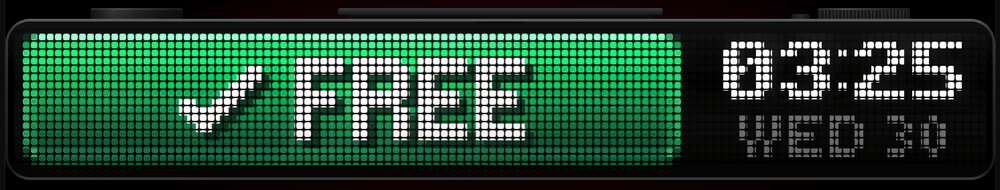
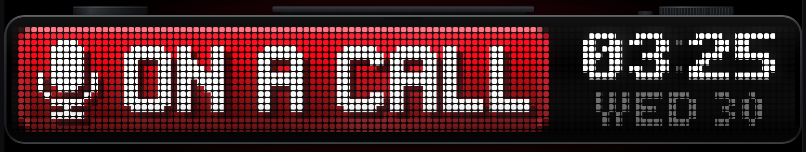
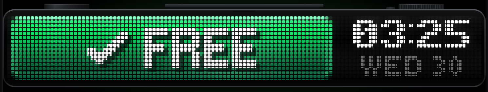
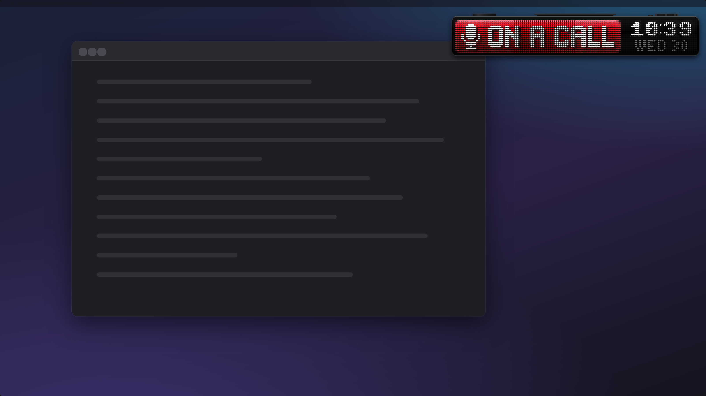

# Studio Call Sign



A full-screen wall display for a Mac: a pixel-LED status bar in the style of
Flipper's BUSY Bar, showing **ON A CALL** or **FREE** beside a clock — or the
same bar as a small floating window on your desk screen. The
state is detected automatically from which app has your microphone — Zoom,
Teams, Google Meet, FaceTime, or anything else.

This is **version 2**, on the `busy-bar` branch. Version 1 — a broadcast studio
clock beside an on-air-style sign — is on `main`, and its mock is `mock.html`.

**See it without building anything:** open `simulator/index.html` in a
browser, or the [hosted preview](https://claude.ai/artifact/XHq4RQY4TnYKvfqn9SbRrF)
(private to your claude.ai account). It runs the same drawing engine as the
app, on your real clock.

| ON A CALL | FREE |
|---|---|
|  |  |

As a floating window (the simulator's **Floating window** button shows this):



## Download

**[Download the latest build](https://github.com/woody438/studio-call-sign/releases/latest)**
(`StudioCallSign.zip`; you need to be signed in to GitHub, as the repo is private).

1. Unzip it and drag **StudioCallSign** into Applications.
2. Open it. The first time, macOS says it can't check the app for malicious
   software, because it isn't notarised by Apple. Click **Done**, then go to
   System Settings ▸ Privacy & Security, scroll down, and click **Open Anyway**.
   (Or in Terminal: `xattr -dr com.apple.quarantine /Applications/StudioCallSign.app`.)
3. The full-screen display opens on your second monitor, and a **controls
   window** opens on your main one. Click the app's Dock icon to bring the
   controls back at any time.

It runs on Apple silicon and Intel Macs with macOS 14.4 or later. Every push
to `busy-bar` rebuilds it on GitHub's Mac runners
(`.github/workflows/build.yml`) and replaces the release.

> **Built, but not yet run.** It compiles cleanly with Xcode 16.4 (no errors,
> no warnings) and its checks pass on macOS, but nobody has yet opened it on a
> real screen. See [What's been verified](#whats-been-verified--and-what-hasnt).

## Build it yourself

You need macOS 14.4 or later, **Xcode 15.3 or later** (the Core Audio process
API it uses first appears in the macOS 14.4 SDK; older Xcode won't compile it),
and [Homebrew](https://brew.sh).

```sh
git clone https://github.com/woody438/studio-call-sign
cd studio-call-sign
git checkout busy-bar
brew install xcodegen
xcodegen generate
open StudioCallSign.xcodeproj        # then Product ▸ Run (⌘R)
```

Or without opening Xcode:

```sh
xcodebuild -project StudioCallSign.xcodeproj -scheme StudioCallSign \
  -configuration Release -derivedDataPath build build
open build/Build/Products/Release/StudioCallSign.app
```

- It signs with **Sign to Run Locally**, so no Apple developer account is needed.
- Change build settings in `project.yml`, not in Xcode — `xcodegen generate`
  replaces the project, including anything changed in its settings screens.
  Re-run it after adding or removing source files.
- There are no permission prompts: the app checks whether devices are *in use*;
  it never records.

## Setting up the wall display

- **Use the display's default "looks like 1920 × 1080", or its native
  resolution** (System Settings ▸ Displays). A scaled mode such as "looks like
  2560 × 1440" makes macOS resample the whole screen, so the LED dots can't
  land on whole pixels and may shimmer. The menu warns you if this is the case.
- On first launch the bar opens on whichever display *isn't* your main
  (menu-bar) display, and remembers that monitor. If the wall monitor isn't
  connected yet, it shows on the main display until it is. To move it, pick
  another **Monitor** in the controls window (**Show on** in the menus).
- If the wall monitor sleeps, switches off or is unplugged, the bar waits for
  it rather than jumping onto your desk monitor, and comes back when it does.
- On a secondary display the bar sits above that display's menu bar and Dock,
  so nothing covers it while you're in another app. It ignores clicks, so a
  stray one can't pull focus from a call.
- While it's showing, the Mac won't let displays sleep. macOS applies that to
  every display, not just the wall.

## The floating window

As well as the full-screen display — or instead of it — the bar can float on
your desk screen: just the device, in a window that stays above other windows
and on every Space, including full-screen apps.

- Turn it on with **Floating window** in the controls window or either menu.
  **Full-screen display** is a separate switch, so you can have either or both.
- **Drag it anywhere.** It never takes focus, so moving it mid-call leaves
  you in the call app.
- **Floating size** — Small, Medium or Large (600, 900 or 1200 points wide).
  On a Retina screen these put the LEDs on exactly 10, 15 or 20 pixels. Also
  on its right-click menu.
- It remembers where it was, its size, and which views were on when you quit.
  First launch opens the full-screen display only.

## The controls

The same controls are in three places:

- **The controls window** — click the app's Dock icon, or press ⌘, while the
  app is in front. It opens by itself on first launch.
- **The Dock icon's right-click menu** — full-screen on/off, which monitor,
  floating on/off.
- **The menu-bar icon** — a tick when free, a microphone on a call. On a
  crowded menu bar macOS may hide it; the other two always work.

The full menu:

- **Status** — what the detector sees, e.g. "Source — zoom.us · mic active · cam active".
- **Sign** — Automatic, or force ON A CALL / FREE (for in-person meetings, recording).
- **Detect** — *Any app except ignored* (default) or *Known call apps only*.
- **Microphone** — every app holding the mic right now, each with an
  **Ignore** toggle. If something that isn't a call lights the sign, ignore it
  here; it's remembered.
- **Full-screen display** (on/off) and **Show on** (which monitor; the
  controls window calls it Monitor).
- **Floating window** (on/off) and **Floating size**.
- **Settings…** (⌘,) opens the controls window; **Quit** (⌘Q). Opening the app again with nothing showing brings the
  full-screen display back.

## How it decides you're on a call

Once a second it asks Core Audio which processes have microphone input
running (`kAudioProcessPropertyIsRunningInput`, macOS 14.2+). For each one:

1. **Helpers count as their app.** Browsers and Electron apps capture audio in
   helper processes, so each process is traced to the outermost `.app` it runs
   from: Meet in a Chrome helper counts as Chrome.
2. **Dictation and audio tools are ignored** — Wispr Flow, superwhisper,
   MacWhisper, Talon, Krisp, DAWs, OBS — by bundle ID, and dictation tools by
   name too, in case the bundle ID is one it doesn't know.
3. **Apple's own processes are ignored** — Siri, Dictation, Live Captions,
   Sound Recognition (which listens all the time) — **except** FaceTime (whose
   audio runs in `avconferenced`) and Safari (whose audio runs in WebKit).
4. **Anything else counts**, under the default policy. *Known call apps only*
   restricts it to a list in `CallDetector.swift`.

The sign follows only once a change has held: **2 seconds** before it lights,
**10 seconds** before it goes dark, so a moment's silence never flickers it.
Zoom, Teams and Meet keep the mic open while you're muted, so the sign stays
lit through mute.

Worth knowing:

- Some apps release the mic when you mute (Slack huddles and Discord, reportedly).
  During a long mute in those, the sign returns to FREE after 10 seconds.
- The Wispr Flow bundle IDs in the ignore list are best guesses. If dictation
  lights the sign, use **Microphone ▸ Ignore Wispr Flow** once.
- If Core Audio's per-process API ever fails to answer, it falls back to "is
  the default input device in use by anyone" — which can't tell dictation
  from a call. The status line then says "unattributed".

## How the display works

The bar is **118 × 16 LEDs**. Sixteen rows is what gives the BUSY Bar's type its
chunk, so that's kept; the real device is 72 columns, too narrow to set
"ON A CALL" beside a clock, so this one runs wider. At 32 pixels per LED it
spans a 4K screen exactly: full width, 31% tall, every LED on whole pixels.

Almost everything comes from the BUSY Bar's own open-source firmware:

- **Pixel fonts** — decoded from the firmware (OFL-licensed): `busy_bold_10`
  for the status, `busy_regular_14` for the announcement, `busy_bold_7` and
  `busy_regular_5` for the clock, as the firmware's clock app uses them.
- **Colours** — sampled from its animation frames: the pill's red and green
  gradients, highlight row and rim.
- **Dots** — Flipper's own preview shader: rounded squares at 85% of the
  pitch, shading toward their corners; unlit LEDs vanish into the black face.
  Colours are corrected for the firmware's LED gamma (value^2.6–2.8).
- **Layout** — its timer screen: lit pill on the left; time in white on black
  to the right, day beneath at half brightness; colon dimming on odd seconds.
- **A change of state** — as the device does it: the old screen presses down,
  a ring bursts from the top edge and floods the panel, and the new screen
  springs up. The status fills the bar in 14-row capitals for a few seconds,
  then the pill draws back and the time slides in beside it.

The words are **ON A CALL** rather than the firmware's own "ON CALL", which in
British English means on standby. The mic pictogram echoes the firmware's
on-call theme; the tick is the "available" mark meeting apps use.

In the code:

| | |
|---|---|
| `Sources/Bar/BarEngine.swift` | Decides every LED's colour for a moment in time. A line-for-line port of `simulator/engine.js`. |
| `Sources/Bar/LEDRaster.swift` | Turns a frame into panel pixels: dots, shading, gamma, glass. |
| `Sources/Bar/LEDPanelView.swift` | Runs engine and raster on each display refresh and hands the pixels to a layer. |
| `Sources/Bar/BarDisplayView.swift`, `BarGeometry.swift` | The screen: the device body and where the LEDs go. |
| `Sources/Bar/PixelFonts.swift`, `FontData.swift` | The firmware's fonts. |
| `Sources/CallDetector.swift`, `AudioProbe.swift`, `CameraProbe.swift` | Call detection. |
| `Sources/DisplayWindow.swift` | The full-screen window. |
| `Sources/FloatingWindow.swift` | The floating window. |
| `Sources/StudioCallSignApp.swift` | The menu. |
| `simulator/` | The browser version, where the look is designed. |
| `Checks/` | Tests that run anywhere Swift does. |

## What's been verified — and what hasn't

**Built on macOS** by GitHub Actions with Xcode 16.4 (Swift 6.1.2): the whole
app, as a universal (Apple silicon + Intel) binary, ad-hoc signed; no compiler
errors or warnings in its code.

**Verified by running**, with Swift 6.0.3 on Linux and again on macOS (`Checks/run.sh`):

- **The Swift engine matches the simulator LED for LED** across 17 moments —
  the press, shockwave, announcement, collapse, slide-in, both states, cold
  start — to within float rounding. What you see in the simulator is what the
  app draws.
- **Every LED lands on whole pixels** on eight common displays — 4K at 1× and
  2×, 1080p, 1440p, 5K, 6K, ultrawide — and at all three floating sizes at 1×
  and 2×, with the whole device inside the window. (This check caught a real bug.)
- **A frame takes 2.6 ms** at 4K in the worst case, on four slow virtual
  cores — the display allows 16.7 ms.
- **The call detector makes the right decisions** on a scripted 40 seconds:
  Zoom lights the sign after exactly 2 s and it goes dark exactly 10 s after;
  dictation through a helper, an always-listening Apple process and a
  one-second blip don't light it; both overrides are instant; Meet in a
  Chrome helper does light it.
- The pixel fonts decode correctly, and every source file parses.

**Compiled, not yet run:** the AppKit, SwiftUI and Core Audio code —
`DisplayWindow`, `FloatingWindow`, `StudioCallSignApp`, `LEDPanelView`, `BarDisplayView`,
`AudioProbe`, `CameraProbe`. If something misbehaves on first launch, these
are the likeliest places:

1. `AudioProbe.swift` — the Core Audio process properties: does the menu's
   Microphone list show the app you're calling from?
2. `DisplayWindow.swift` — placement on the wall screen, and the scaled-mode
   warning (`CGDisplayCopyAllDisplayModes`).
3. `LEDPanelView.swift` — the display link (`NSView.displayLink`, macOS 14).
4. `FloatingWindow.swift` — the window's shadow, traced from the device's
   outline; if it's missing or boxy, that's where to look.

## Running the checks

```sh
Checks/run.sh          # needs swiftc (Xcode) and node
```

## Handing this to Claude Code on your Mac

From the project directory run `claude`, then:

> This SwiftUI macOS app builds but hasn't been tried on a real screen — read
> README.md. Run `xcodegen generate`, build with xcodebuild, run
> Checks/run.sh, then launch the app and compare it against
> simulator/index.html.

## Credits and licences

- Pixel fonts from the [BUSY Status Bar firmware](https://github.com/busy-app/busybar-firmware)
  — © 2021 TakWolf ([Ark Pixel](https://ark-pixel-font.takwolf.com/)), © 2024–2026 Flipper FZCO —
  under the SIL Open Font License 1.1 (`LICENSES/OFL-1.1.txt`).
- The transitions are original code, modelled on the firmware's CC BY-SA 4.0
  animations; no animation frames are included.
- Not affiliated with or endorsed by Flipper Devices.
